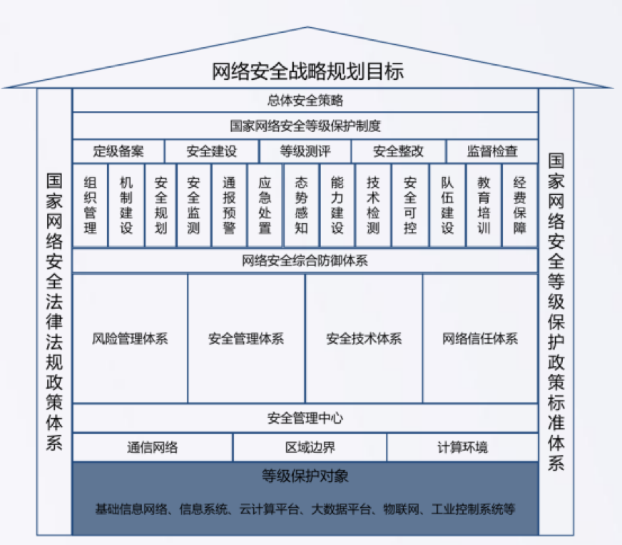
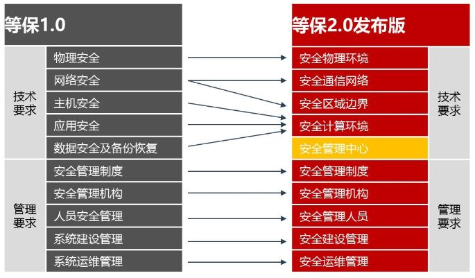

## 等级保护2.0

**一、安全框架**

“一个中心，三重防护”：安全管理中心 + 安全通信网络，安全区域边界，安全计算环境。

**一、作用对象**

基础信息网络、信息系统（例如，工业控制系统、云计算平台、物联网、使用移动互联技术的信息系统以及其他信息系统）和大数据等。

**二、分类结构**

技术部分：安全物理环境、安全通信网络、安全区域边界、安全计算环境、安全管理中心； 

管理部分：安全管理制度、安全管理机构、安全管理人员、安全建设管理、安全运维管理。

等保1.0对比2.0要求项对比：

**三、安全控制点**

**安全物理环境：**物理位置的选择、物理访问控制、防盗窃和防破坏、防雷击、防火、防水和防潮、防静电、温湿度控制、电力供应和电磁防护。

安全通信网络：网络架构、通信传输和可信验证。

**安全区域边界：**边界防护、访问控制、入侵防范、恶意代码防范、安全审计和可信验证。

**安全计算环境：**身份鉴别、访问控制、安全审计、入侵防范、恶意代码防范、可信验证、数据完整性、数据保密性、数据备份与恢复、剩余信息保护和个人信息保护。安全管理中心：系统管理、审计管理、安全管理和集中管控。

**安全管理制度：**安全策略、管理制度、制定和发布以及评审和修订。

**安全管理机构：**岗位设置、人员配备、授权和审批、沟通和合作以及审核和检查。

**安全管理人员：**人员录用、人员离岗、安全意识教育和培训以及外部人员访问管理。

**安全建设管理：**定级和备案、安全方案设计、安全产品采购和使用、自行软件开发、外包软件开发、工程实施、测试验收、系统交付、等级测评和服务供应商管理。

**安全运维管理：**环境管理、资产管理、介质管理、设备维护管理、漏洞和风险管理、网络和系统安全管理、恶意代码防范管理、配置管理、密码管理、变更管理、备份与恢复管理、安全事件处置、应急预案管理和外包运维管理。

**云计算：**基础设施位置、网络架构、网络边界的访问控制、网络边界的入侵防范、网络边界的安全审计、集中管控、计算环境的身份鉴别、计算环境的访问控制、计算环境的入侵防范、镜像和快照保护、数据安全性、数据备份恢复、剩余信息保护、云服务商选择、供应链管理和云计算环境管理。

**移动互联：**无线接入点的物理位置、无线和有线网络之间的边界防护、无线和有线网络之间的访问控制、无线和有线网络之间的入侵防范，移动终端管控、移动应用管控、移动应用软件采购、移动应用软件开发和配置管理。

**物联网：**感知节点的物理防护、感知网的入侵防范、感知网的接入控制、 感知节点设备安全、网关节点设备安全、抗数据重放、数据融合处理和感知节点的管理。

**工业控制系统：**室外控制设备防护、网络架构、通信传输、访问控制、拨号使用控制、无线使用控制、控制设备安全、产品采购和使用以及外包软件开发。

**四、参考**

1、网络安全等级保护及其相关标准介绍_张旭刚：http://kns.cnki.net//KXReader/Detail?TIMESTAMP=637082392709788750&DBCODE=CJFQ&TABLEName=CJFDTEMP&FileName=ZBZD201909011&RESULT=1&SIGN=SZigVQAUGooZtl75ct5UUREEhhk%3d

2、《网络安全等级保护基本要求》(GB/T 22239-2019)标准解读_马力：http://kns.cnki.net/KCMS/detail/detail.aspx?dbcode=CJFQ&dbname=CJFDLAST2019&filename=XXAQ201902011&v=MDI3MTZaWVI4ZVgxTHV4WVM3RGgxVDNxVHJXTTFGckNVUkxPZVp1WnVGQ2prV3J2TlBUWEtmN0c0SDlqTXJZOUU=

3、等保2.0时代的政务云安全实践：http://www.h3c.com/cn/d_201905/1189878_30008_0.htm