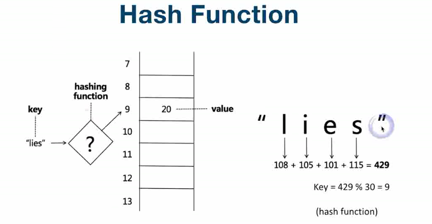
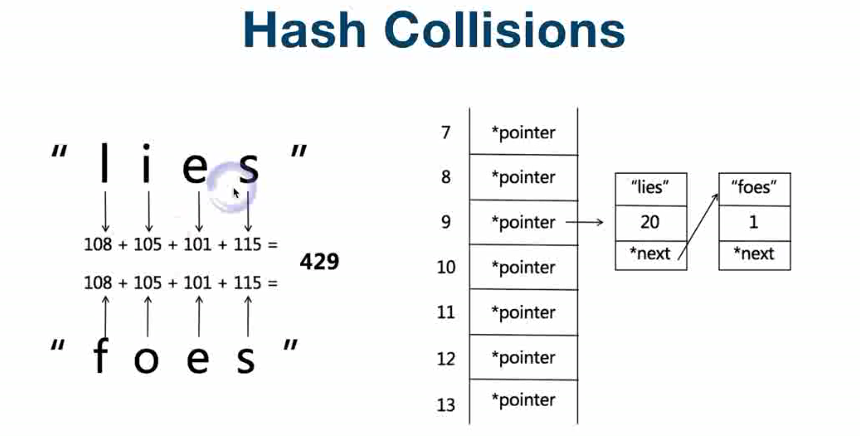
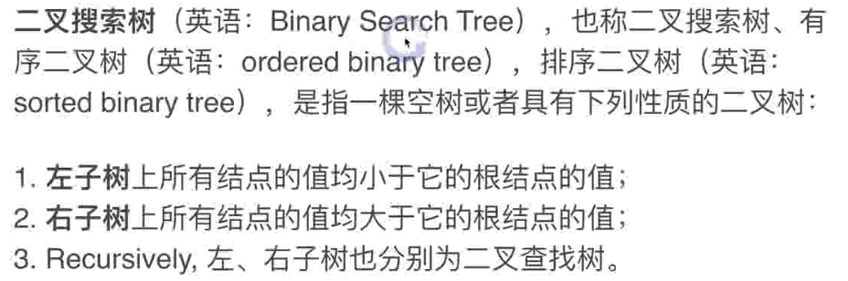
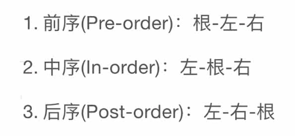
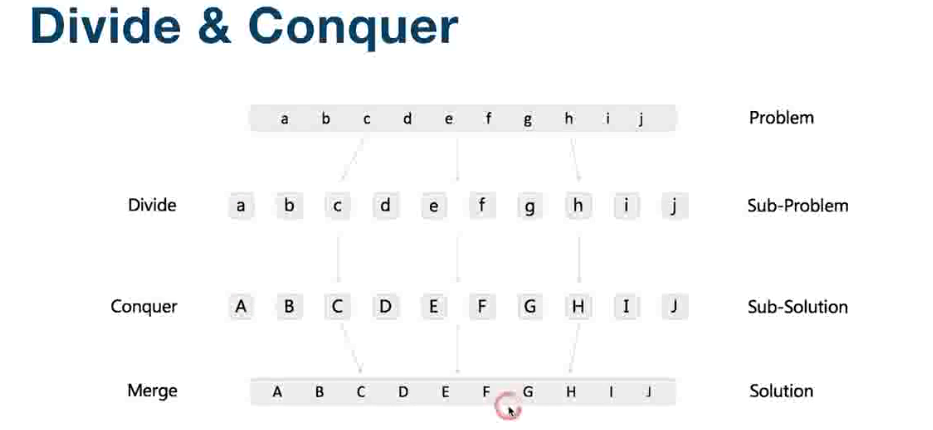
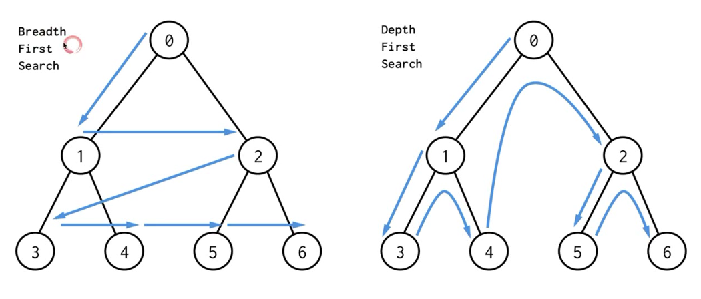
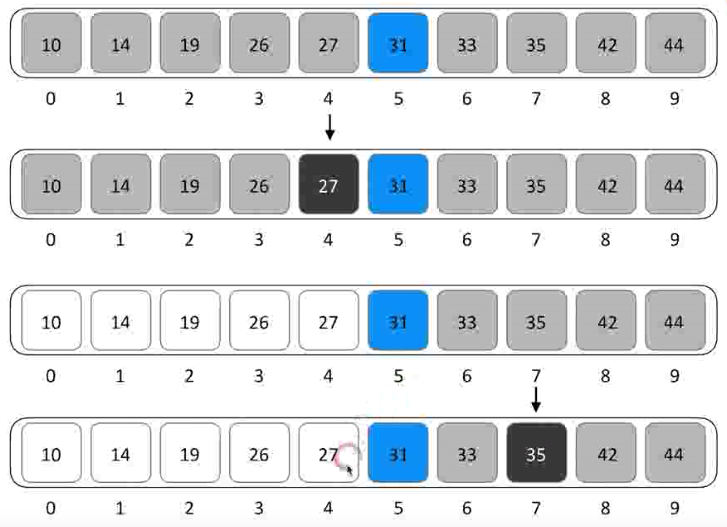
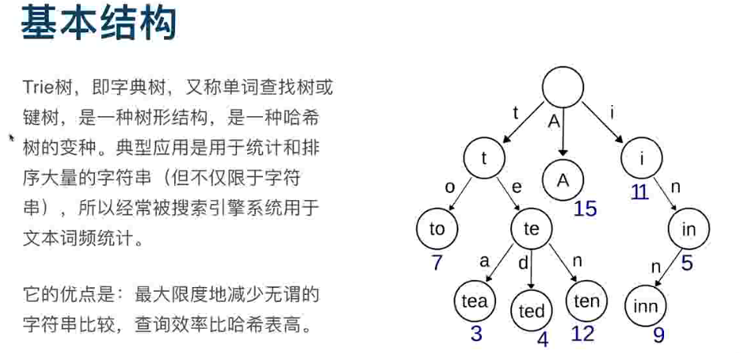

- **哈希表：**
- 
- 
- **Linked List 就是特殊化的Tree；Tree 就是特殊化的Graph。**
- **二叉搜索树：**
- 
- 
- **分治：类似于庖丁解牛**
- 
- **贪心算法（Greedy）：在对问题求解时，总是作出在当前看来是最好的选择。**
- **广度优先搜索、深度优先搜索：**
- 
- **剪枝：IBM深蓝的演算法（穷举爆破），当前分支失败时直接剪掉。**
- 
- **二分查找（Binary Search）：**
- 
- **Trie树：**
- 