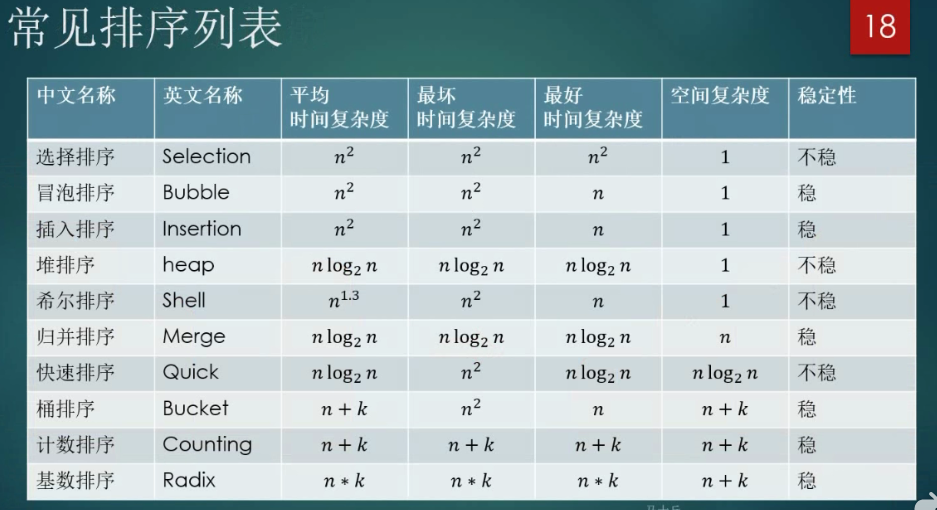

- **哈希表：**

- **Linked List 就是特殊化的Tree；Tree 就是特殊化的Graph。**

- **二叉搜索树：**

- **分治（Divide&Conquer）：类似于庖丁解牛**

- **贪心算法（Greedy）：在对问题求解时，总是作出在当前看来是最好的选择。**

- **广度优先搜索、深度优先搜索：**

- **剪枝：IBM深蓝的演算法（穷举爆破），当前分支失败时直接剪掉。**

- **二分查找（Binary Search）：**

- **Trie树：**

- **堆**是一种完全二叉树，有最大堆和最小堆两种。

- **优先队列（Priority Queue）** ：虽然名字有队列，但其实是使用**堆**来实现的。入队的时候可以给一个优先级，通常是个数字或者时间戳等，当出队的时候我们希望按照给定的优先级出队。
- **图（Graph）**：人物关系、路径选择，简单地说就是有节点(node)和边(edge)组成的一种数据结构，相邻的节点称之为邻居。
- 常见排序算法：